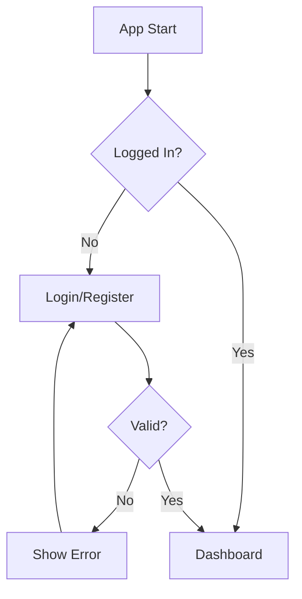
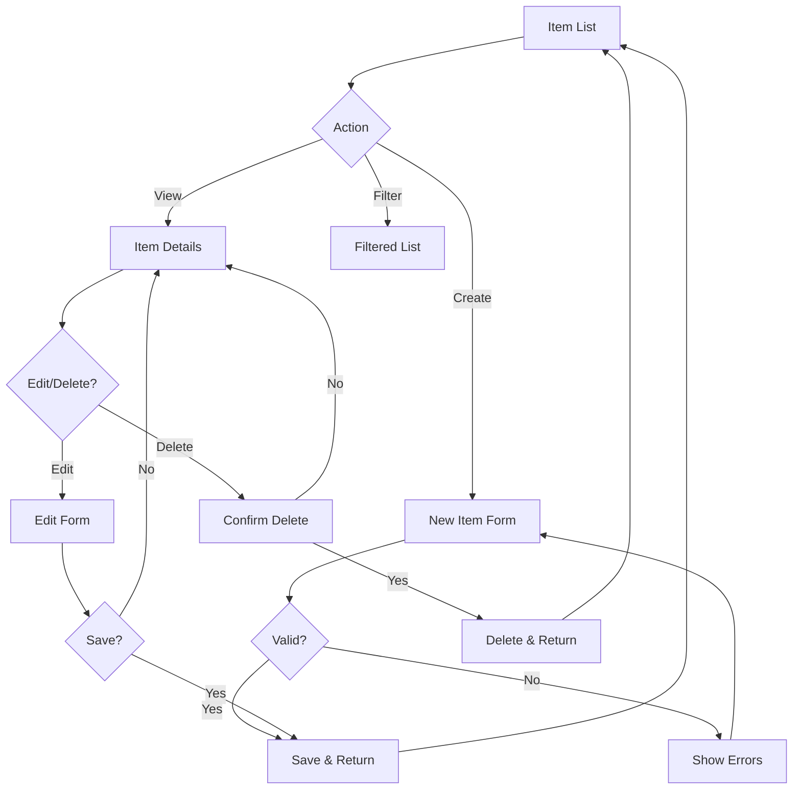
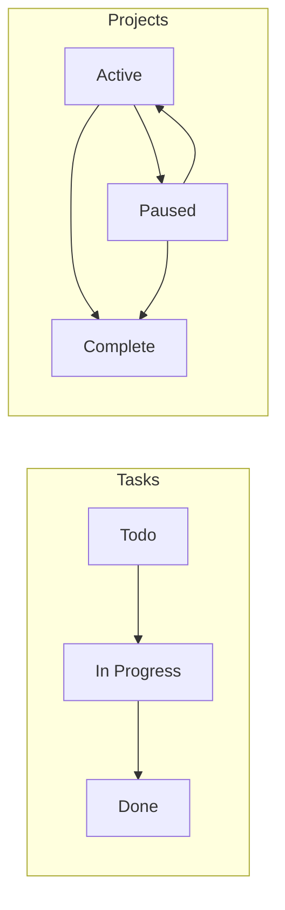
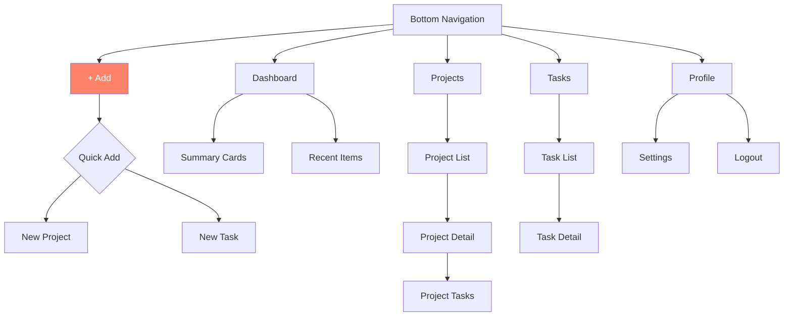
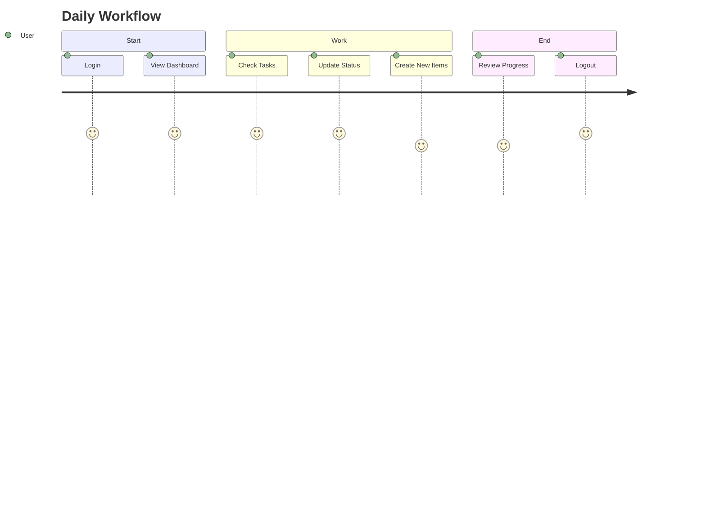

# ProKer App Workflows - Simplified

## Overview
ProKer uses a simple, consistent workflow pattern across all features. This document outlines the 4 core user flows that cover 90% of all interactions.

## 1. Authentication Flow

## 2. Item Management Flow (Projects & Tasks)

Single pattern for all CRUD operations:

## 3. Status Management Flow

Simple 3-state transitions:

## 4. Navigation Flow

## User Journey - Simplified

## Core Principles

1. **Consistency**: Same pattern for all items (projects, tasks)
2. **Simplicity**: Maximum 3 states per entity
3. **Clarity**: Each screen has one primary purpose
4. **Efficiency**: Most actions complete in 2-3 taps

## Primary Actions (80% of usage)

- View lists and items
- Create new items
- Update item status
- Basic edits

## Secondary Actions (20% of usage)

- Delete items
- Advanced filters
- Bulk operations
- Settings changes

## Error Handling Pattern

All errors follow the same simple pattern:

1. Validate input
2. Show inline error if invalid
3. Allow retry
4. Show success confirmation when complete

## Data States

Each list can be in one of three states:

- **Loading**: Show spinner
- **Empty**: Show helpful message with action button
- **Data**: Show list with items

That's it! The entire app workflow in under 150 lines.