# ProKer App Workflows

## User Authentication Flow

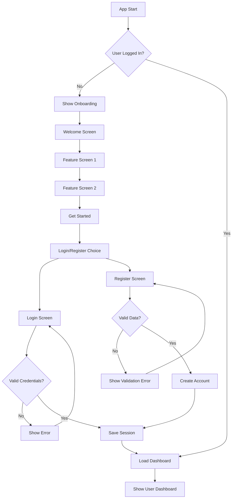

## Project Management Flow

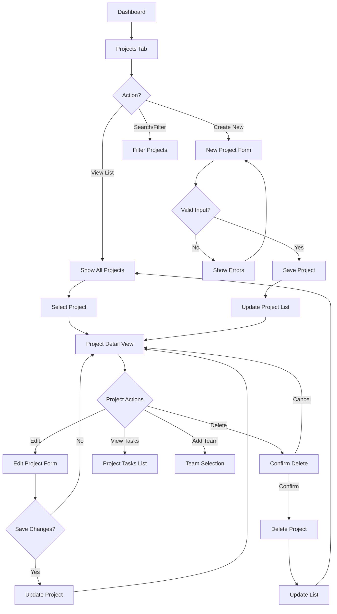

## Task Management Flow

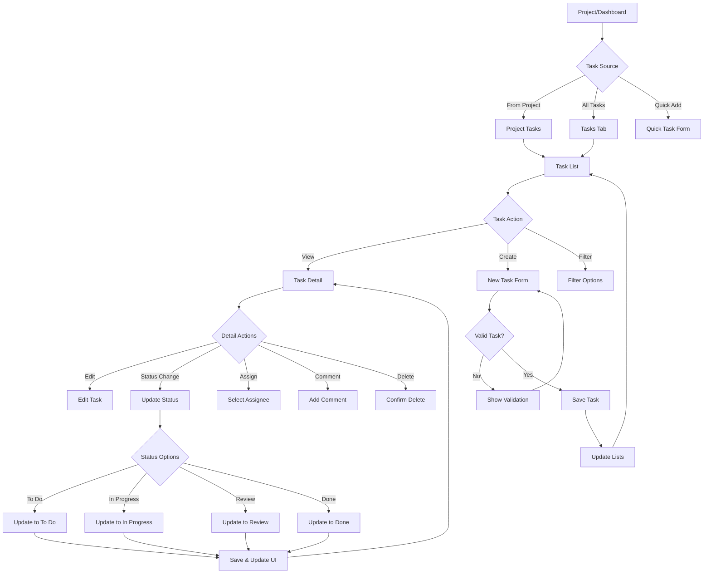

## User Journey - Project Manager

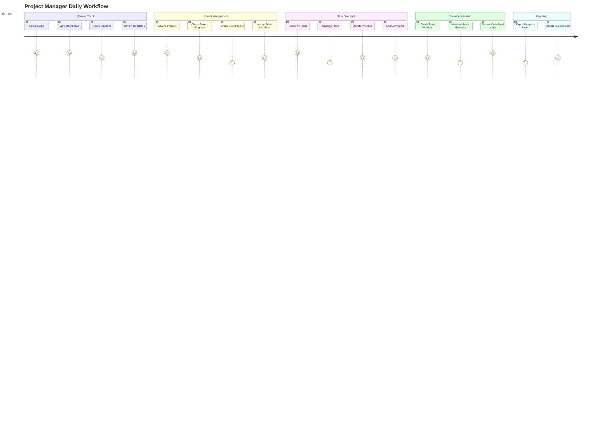

## User Journey - Team Member

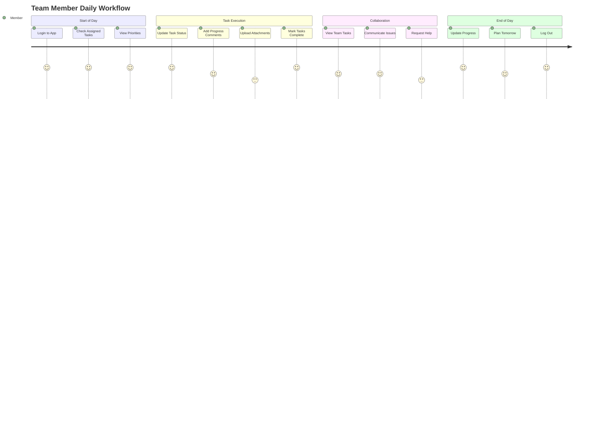

## State Diagram - Task Lifecycle

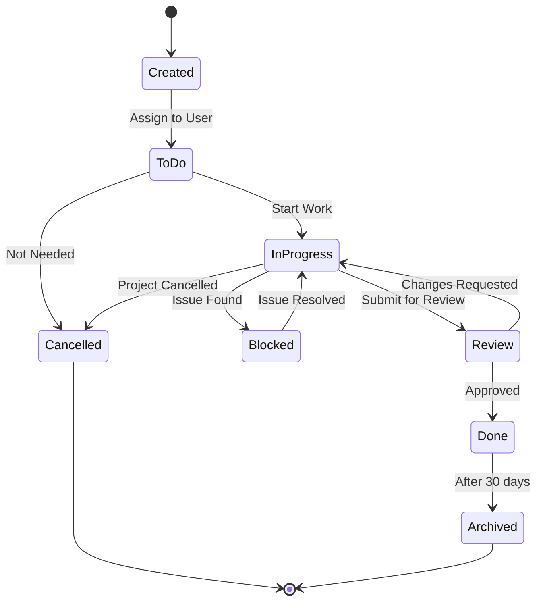

## State Diagram - Project Lifecycle

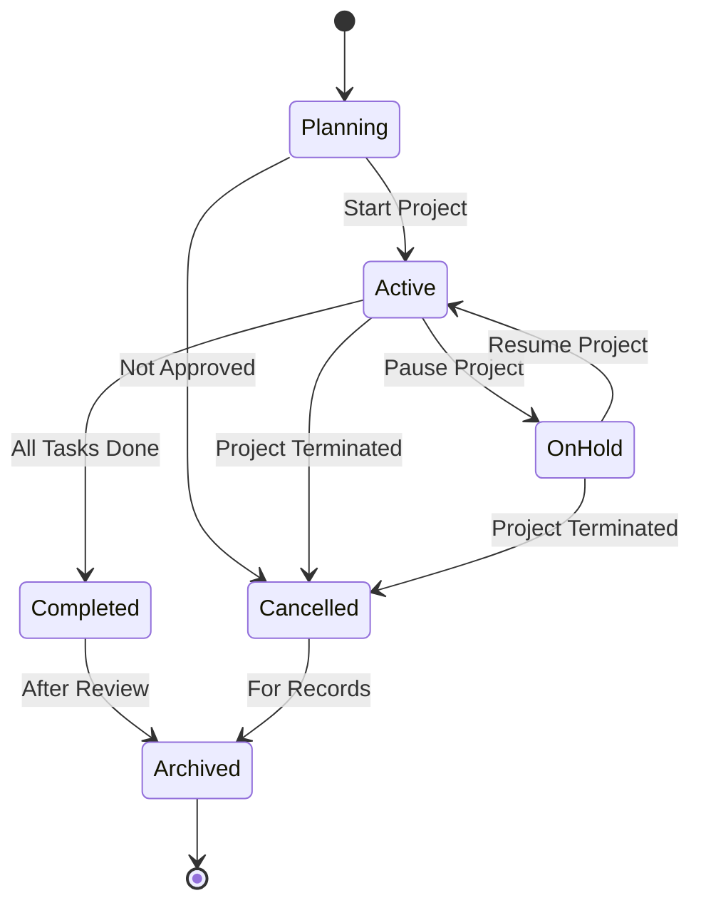

## Data Flow Diagram

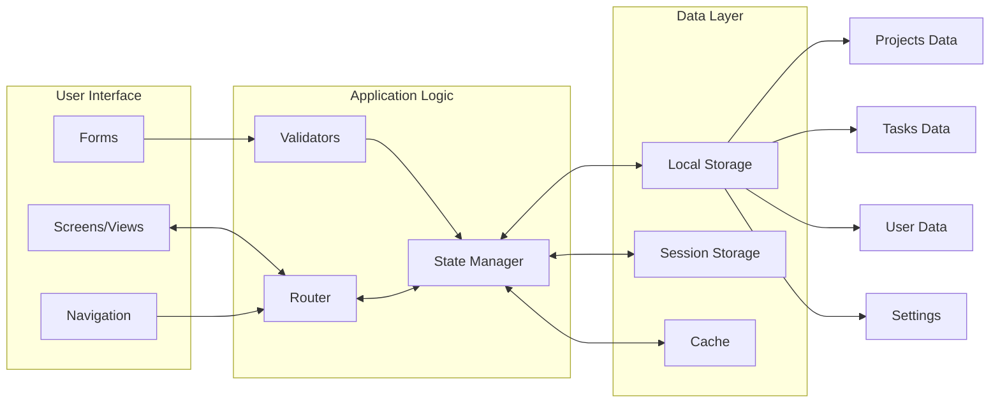

## Component Interaction Flow

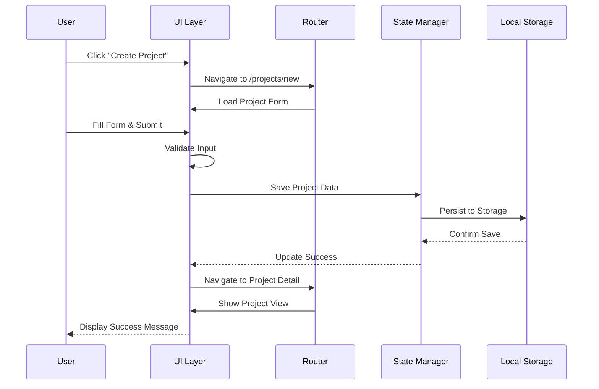

## Error Handling Flow

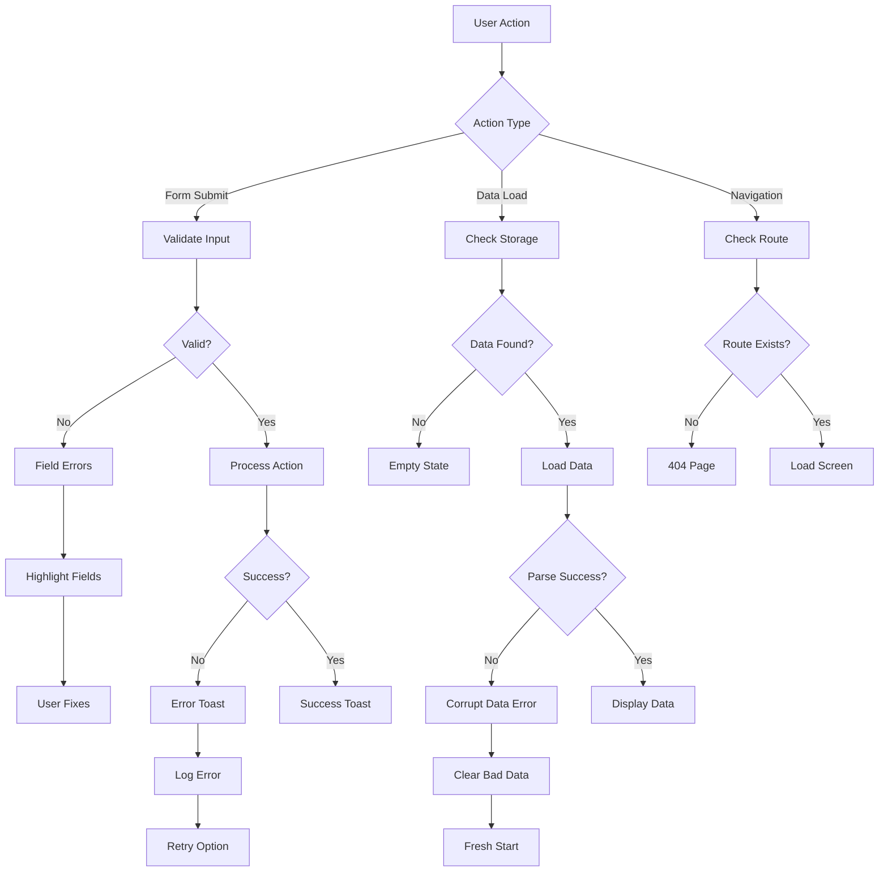

## Navigation Flow

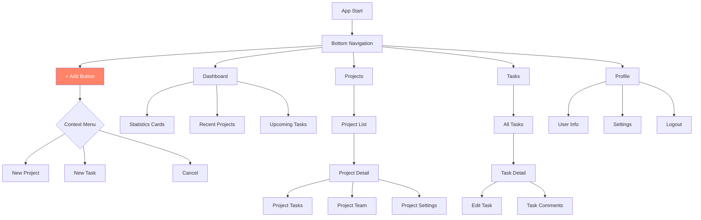

## Performance Optimization Flow

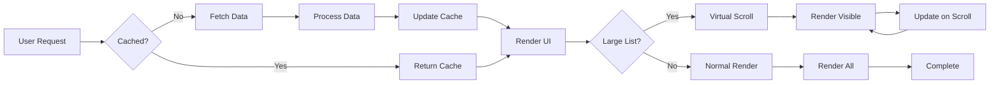

## Security Flow

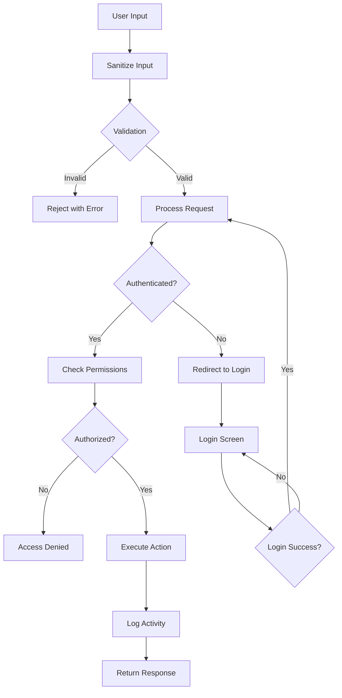